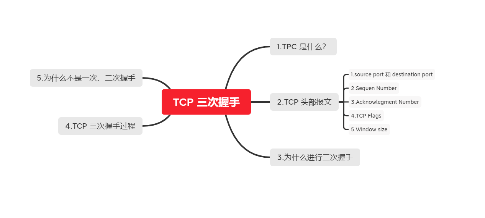
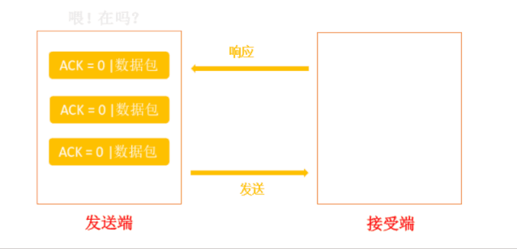
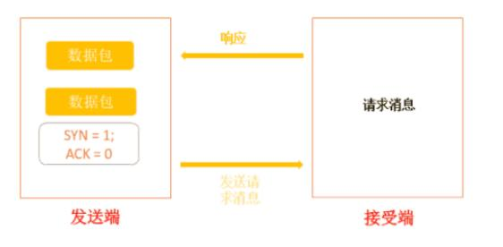
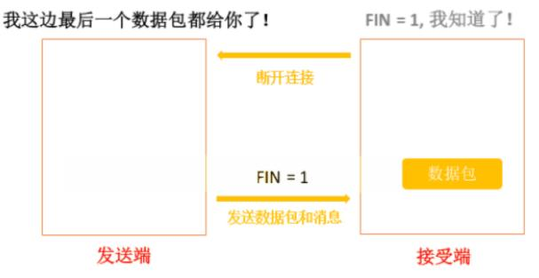
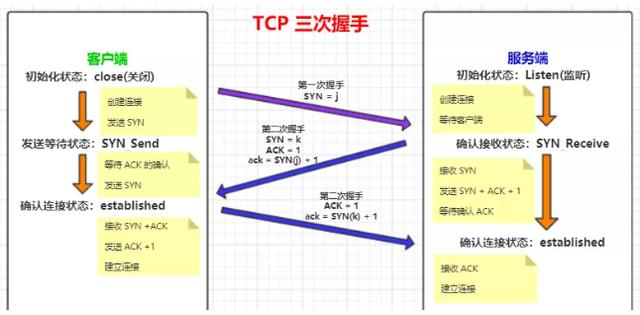
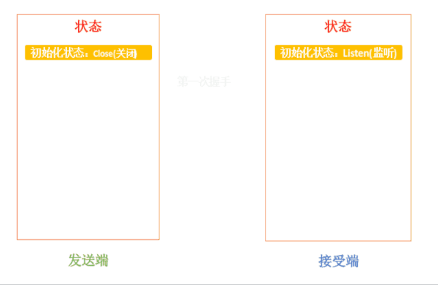
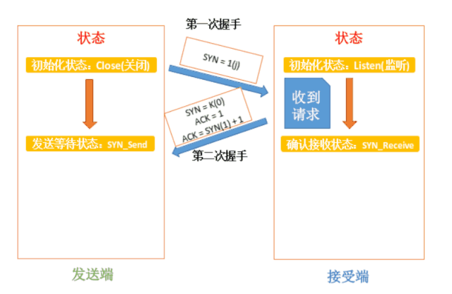
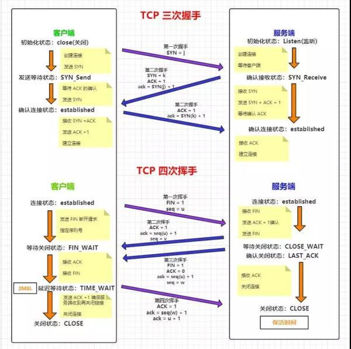

#  TCP 详解

- [TCP 详解](#tcp-%e8%af%a6%e8%a7%a3)
  - [1.1. 思维导图](#11-%e6%80%9d%e7%bb%b4%e5%af%bc%e5%9b%be)
  - [1.2. TCP 是什么？](#12-tcp-%e6%98%af%e4%bb%80%e4%b9%88)
  - [1.3. TCP 头部报文](#13-tcp-%e5%a4%b4%e9%83%a8%e6%8a%a5%e6%96%87)
    - [1.3.1. ️⃣ Source Port 和 Destination Port](#131-%ef%b8%8f%e2%83%a3-source-port-%e5%92%8c-destination-port)
    - [1.3.2. ️⃣ Sequence Number](#132-%ef%b8%8f%e2%83%a3-sequence-number)
    - [1.3.3. ️⃣ ACKnowledgment Number](#133-%ef%b8%8f%e2%83%a3-acknowledgment-number)
    - [1.3.4. ️⃣ TCP Flag](#134-%ef%b8%8f%e2%83%a3-tcp-flag)
  - [1.4. TCP为什么进行三次握手](#14-tcp%e4%b8%ba%e4%bb%80%e4%b9%88%e8%bf%9b%e8%a1%8c%e4%b8%89%e6%ac%a1%e6%8f%a1%e6%89%8b)
  - [1.5. TCP三次握手过程](#15-tcp%e4%b8%89%e6%ac%a1%e6%8f%a1%e6%89%8b%e8%bf%87%e7%a8%8b)
  - [1.6. 为什么不是一次、两次握手](#16-%e4%b8%ba%e4%bb%80%e4%b9%88%e4%b8%8d%e6%98%af%e4%b8%80%e6%ac%a1%e4%b8%a4%e6%ac%a1%e6%8f%a1%e6%89%8b)
  - [1.7. 四次分手](#17-%e5%9b%9b%e6%ac%a1%e5%88%86%e6%89%8b)

## 1.1. 思维导图 

## 1.2. TCP 是什么？

TCP(Transmission Control Protocol 传输控制协议) 是一种面向连接的、可靠的、基于字节流的传输层控制协议

通信协议就是双方通信的一个规范标准。

## 1.3. TCP 头部报文

TCP 三部握手主要是头部信息状态的确认与更新，如果想要理解三次握手的原理必须理解TCP头部报文。

.jpg)

### 1.3.1. ️⃣ Source Port 和 Destination Port

这两个分别是 [源端口] 与 [目标端口]。源端口指的就是本地端口，目的端口就是远程端口。

一个数据包(Pocket)被解 封装成数据段(Segment)后就会涉及到连接上层协议的端口问题。

源端口与目的端口就是确定发送方与接收方通过哪些窗口发送\接收对方的数据。

扩展：应用程序的端口号和应用程序所在主机的 IP 地址统称为 Socket(套接字)，IP：端口号，在互联网上 Socket 唯一标识每一个应用程序。

源端口+源 IP+目的端口+目的 IP 称为“套接字对”，一对套接字就是一个连接，一个客户端与服务器之间的连接。

### 1.3.2. ️⃣ Sequence Number

[序列号]。用于TCP通信过程中某一传输方向上字节流的每个字节编号，为了确保数据通信的有序性，避免网络中乱序的问题。

接收端根据这个编号进行确认，保证分割的数据段在原始数据包的位置。

为了确认发送的数据包能正确拼接数据，确定每个字段在数据中的位置。需要用序列号来标记数据包的所在位置。序列号就是用来完成双方传输中确保字段原始位置是按照传输顺序的。（即发送方式一个什么顺序发送的，接收方也要是按照这个顺序拼接和接收的）

PS：初始序列号由自己定，而后绪的序列号由对端的 ACK 决定：SN_x = ACK_y(x 的序列号 = y 发给 x 的 ACK)，这里后边会讲到。

### 1.3.3. ️⃣ ACKnowledgment Number

[确认序列号]，确认序列号是接收端所期望收到的下一序列号。确认序列号应当是上次已成功接收的序列号加 1，只有当标志位中的ACK标志位 1 时该确认序列号才有效，主要用来解决不丢包的问题。

若确认号 = N, 则表明： 到序列号 N - 1 为止的数据已正确接收到。

在这里，现在我们只需要知道它的作用是什么，就是在数据传输时候是一段一段的，都是由序列号进行标识的，所以说接收端每接收一段，之后想要接收的下一段的序列号就称为[确认序列号]。

### 1.3.4. ️⃣ TCP Flag

TCP 首部中有6个标志比特，他们中的多个可同时被设置为 1，主要是用于操控TPC 的状态机的，依次为 [URG,ACK,PSH,RST,SYN,FIN].

初学者不要全部掌握，讲三个重点标志：

ACK: 这个标识可以表示为发送端发送数据到接收端，发送的时候 ACK 为 0，标识接收端还未应答，一旦接收端接收到数据之后，就将 ACK 置为 1，发送端接收之后，就知道接收端已经接收数据了。

此标志标识[应答域有效]，就是说前面的TCP应答号将会包含在TCP数据包中；有两个取值：0 和 1，为 1 表示应答域有效，反之为 0；

SYN: 表示[同步序列号]，TCP握手发送的第一个数据包。

用来建立TCP连接。SYN 标志位和 ACK 标志位搭配使用，当连接请求的时候，SYN = 1,ACK =0; 连接被响应的时候，SYN = 1, ACK = 1; 这个标志的数据包经常被用来进行端口扫描。

扫描这发一个只有SYN的数据包，如果对方主机响应了一个数据包回来，就表明这台主机窜在这个端口。

FIN：表示发送端已经达到数据末尾，也就是说双方的数据传送完成，没有数据可以传送了，发送FIN标志位的TCP数据包后，连接将被断开。这个标志的数据包也经常被用于进行端口扫描。

这个很好理解，就是说，发送只剩下最后一段数据了，同时也告诉接收端后面没有数据接收了，所以用FIN标识一下，接收看到这个FIN之后，哦！这是接收的最后的数据，接收完就关闭了。

Window Size:称之为滑动窗口大小。所说的滑动窗口，用来进行流量控制。

## 1.4. TCP为什么进行三次握手

原因如下：

* 为了确认双方接收与发送能力是否正常
* 指定自己的初始化序列号，为后面的可靠传送做准备
* 如果是 HTTPS 协议的话，三次握手这个过程，还会进行数字证书的验证以及加密秘钥的生成

如果你了解UDP的话，TCP的出现正是弥补了UDP不可靠传输的缺点。但是TCP的诞生也必然增加了连接的复杂性。

## 1.5. TCP三次握手过程

TCP三次握手的过程最重要的就是客户端和服务端的变化，另一个是三次握手过程标志信息的变化，那么掌握TCP的三次握手就简单多了。

第一次握手：主机A发送位码为syn＝1，随机产生seq number=1234567的数据包到服务器，主机B由SYN=1知道，A要求建立联机；

第二次握手：主机B收到请求后要确认联机信息，向A发送ack number=(主机A的seq+1)，syn=1，ack=1，随机产生seq=7654321的包；

第三次握手：主机A收到后检查ack number是否正确，即第一次发送的seq number+1，以及位码ack是否为1，若正确，主机A会再发送ack number=(主机B的seq+1)，ack=1，主机B收到后确认seq值与ack=1则连接建立成功。

完成三次握手，主机A与主机B开始传送数据。

## 1.6. 为什么不是一次、两次握手

防止了服务器端的一直等待而浪费资源。为了防止已失效的连接请求报文段突然又传送到了服务端，因而产生错误。

如果此时客户端发送的延迟的握手信息服务器收到，然后服务器进行响应，认为客户端要和它建立连接，此时客户端并没有这个意思。

但 Server 却以为新的运输连接已经建立，并一直等待 Client 发来数据。这样，Server 的很多资源就白白浪费掉了。

## 1.7. 四次分手

