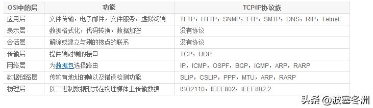

#网络传输的七层协议
作者：泷泽秀明
链接：https://www.zhihu.com/question/50901704/answer/393216656
来源：知乎
著作权归作者所有。商业转载请联系作者获得授权，非商业转载请注明出处。

## 1物理层
打个比方，淘宝卖家利用火车或船运，汽车等把货物送到你手里。而在计算机网络中，信息（货物）的传输我们最直观的感觉就是靠的光纤，双绞线等介质，同时计算机底层是识别二进制数据的，光纤等设备通过电信号（光信号）来表示这些二进制数据，比如大家都用10V表示1 0V表示0，并且规定统一了传输介质的特性，只要各个厂家共遵循这些特质就能正确传递数据了。即，电脑之间（准确来说网络设备之间）物理连接的介质，以及网络设备与网络终端之间数据传递的规则称之为物理层，其中的数据是以比特的形式传递的。单位：比特
## 2数据链路层
有的买家在北京，有的在上海，所以要将仓库的货物分类封装。在链路层中，需要将比特流组合成字节的组合。类似于把地址相同的货物放到同一个集装箱中，只要集装箱到达，货物也就自然到达。这种把比特流组合成字节的组合我们称之为数据帧。对数据进行处理封装成数据帧并传递和错误检测的层就是数据链路层。单位：帧(tips:定义帧的开始和结束)
## 3网络层
淘宝发货，从广州--上海（可以广州-长沙-上海；或者广州-福州-上海），网络层就是负责选择最佳路径，并保证数据始终沿着最佳路径传输。路由器的功能就是选合适的路径。单位：数据包（tips:选择最佳路径，规划IP地址）
## 4传输层
淘宝的货物可能很贵重你买了保险，可能就是很便宜的东西，你和卖家说丢了也无所谓（举个列子好吧）。对于不同的货物有不同的态度，传输层就是负责将数据进行可靠或者不可靠传递，负责终端之间的传送。（端—端！）单位：数据段(tips:确不确认丢包，和流量控制，不可靠通信：如一个数据包直接传输的时候不需要编码物理地址等）
## 5会话层
你的淘宝收货后在小区部分有不同的收货地点（蜂巢快递，日日顺了家，某某快递等），信息传递给对方计算机某些特定的程序，会话层用来区分不同的进程。（tips:如打开两个浏览器，输入两个地址，确认输入的地址和响应的内容在自己想要的浏览器上显示， netstat -n 可以查看会话 ，established为建立连接）
## 6表示层
见名知意。对传输数据进行解密压缩等，针对不同类型数据进行格式描述。（tips：如压缩加密图片后再传输，如微信界面发送信息再传输过程中加密再解密等，开发人员来进行加密 。）
## 7应用层
应用层有点复杂，但是是我们接触的最多的，简单的说，就是我们从屏幕上看到的信息，提供人（小白）和计算机交流的层（tips：能产生网络流量的程序，如单击游戏不属于应用层）另外，七层协议，如果没有底层，上层也无法存在bilibili上有个非常好的网络课程，大家可以去看看，我这个算是比较笼统浅显的解释

