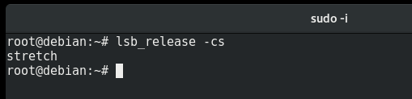
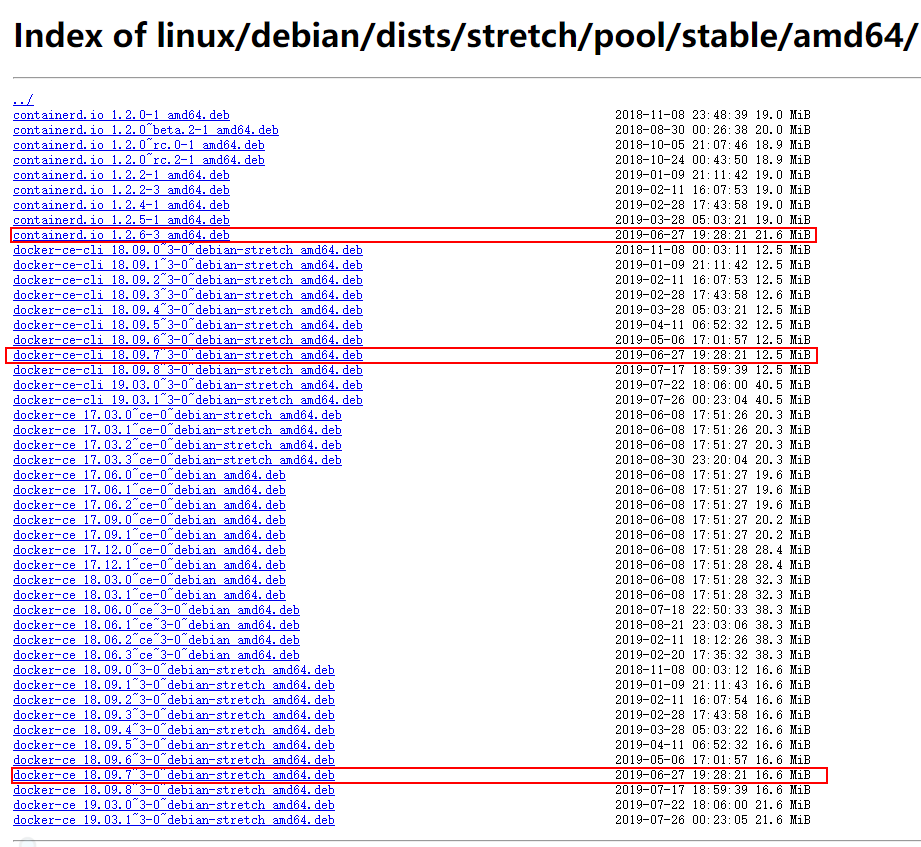

# **docker 的定位与安装**

## **目录**

> * [1.Docker 安装](#1docker-%e5%ae%89%e8%a3%85)
> * [2.Docker 基本命令](#2docker-%e5%9f%ba%e6%9c%ac%e5%91%bd%e4%bb%a4)

## 1.Docker 安装

[Debian 安装文档](https://docs.docker.com/install/linux/docker-ce/debian/ "安装文档")  

1.在终端中运行 <kbd> lsb_release -cs</kbd> 查看发行版本名称  
版本是 <kbd>stretch</kbd>

**进入下载包页面**:https://download.docker.com/linux/
**根据你的发行版本和系统进入对应文件系统** :[/debian/dists/stretch/pool/stable/amd64/](https://download.docker.com/linux/debian/dists/stretch/pool/stable/amd64/)

下载相互依赖的三个 <kbd>.ded</kbd> 

从上到下依次安装：<kbd>dpkg -i ****.deb</kbd>

## 2.Docker 基本命令

参考文档：  
1.[安装](https://docs.docker.com/get-started/)
2.[基本命令](https://docs.docker.com/get-started/part2/)

对基本命令解释：可使用 <kbd>docker COMMAND --help</kbd>进行进行帮助

1.docker run hello-world  

该命令是运行一个本地 hello-world 镜像，若本地不存在该镜像则会从网上获取

    docker run hello-world

    Unable to find image 'hello-world:latest' locally
    latest: Pulling from library/hello-world
    ca4f61b1923c: Pull complete
    Digest:     sha256:ca0eeb6fb05351dfc8759c20733c91def84cb8007aa89a5bf606bc8b315b9fc7
    Status: Downloaded newer image for hello-world:latest

    Hello from Docker!
    This message shows that your installation appears to be working correctly.
    ...

2.docker image ls <kbd>eq</kbd> docker images

列出本地已下载的镜像

    docker image ls

    REPOSITORY               TAG                 IMAGE ID            CREATED             SIZE
    hello-world              latest              fce289e99eb9        7  months ago        1.84kB

3.docker congtainer ls --all
列出本地经过 <kbd>docker run image</kbd> 之后生成的容器(所有状态)

    docker container ls --all

    CONTAINER ID     IMAGE           COMMAND      CREATED            STATUS
    54f4984ed6a8     hello-world     "/hello"     20 seconds ago     Exited (0) 19 seconds ago

docker container ls <kbd>eq</kbd> docker ps 只列出正在运行的容器 

4.Dockerfile docker 生成镜像会执行Dockerfile 生成一个运行环境，docker 容器里运行的是一个docker进程，Dockerfile 就是这个进程运行所依赖的环境

5.docker build --tag=imageName .

    利用当前目录生成一个docker 镜像

6.docker run -d -p 8080:80 imageName

    运行一个镜像 参数 -d 后台运行 -p 端口映射 服务器端口映射容器端口

7.docker cotainer --COMMAND

    docker 容器命令 包含了对 docker run之后生成的容器进行生命周期管理

    
    Usage:	docker container COMMAND

    Manage containers

    Commands:
      attach      Attach local standard input, output, and error streams to a   running container
      commit      Create a new image from a container's changes
      cp          Copy files/folders between a container and the local  filesystem
      create      Create a new container
      diff        Inspect changes to files or directories on a container's  filesystem
      exec        Run a command in a running container
      export      Export a container's filesystem as a tar archive
      inspect     Display detailed information on one or more containers
      kill        Kill one or more running containers
      logs        Fetch the logs of a container
      ls          List containers
      pause       Pause all processes within one or more containers
      port        List port mappings or a specific mapping for the container
      prune       Remove all stopped containers
      rename      Rename a container
      restart     Restart one or more containers
      rm          Remove one or more containers
      run         Run a command in a new container
      start       Start one or more stopped containers
      stats       Display a live stream of container(s) resource usage  statistics
      stop        Stop one or more running containers
      top         Display the running processes of a container
      unpause     Unpause all processes within one or more containers
      update      Update configuration of one or more containers
      wait        Block until one or more containers stop, then print their     exit codes

    Run 'docker container COMMAND --help' for more information on a command.

8.docker tag image username/respository:tag

    标记一个已存在的镜像一个 tag 用于上传

9.docker push username/respository:tag

    上传镜像至用户的库

10.docker pull username/respository:tag 

    下载镜像 可能需要权限 也可以使用 docker run 代替该命令

