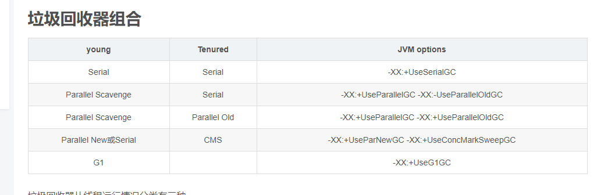
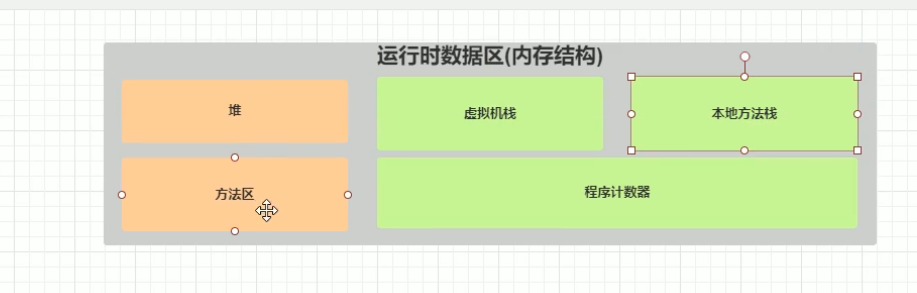
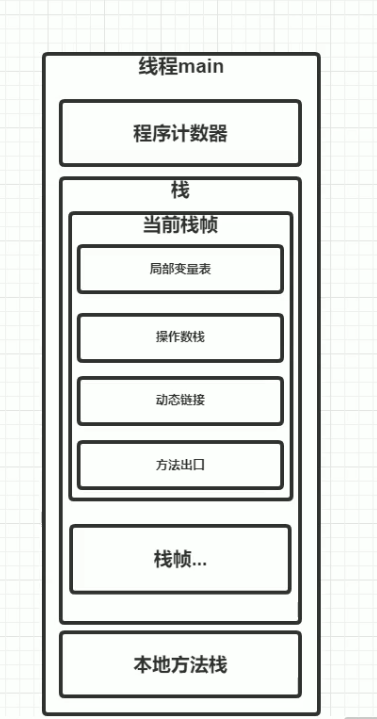
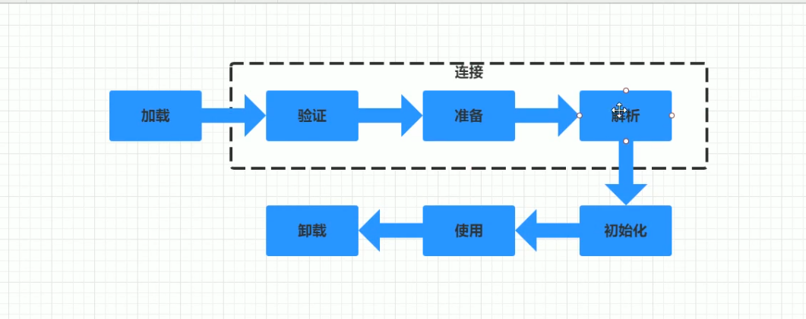
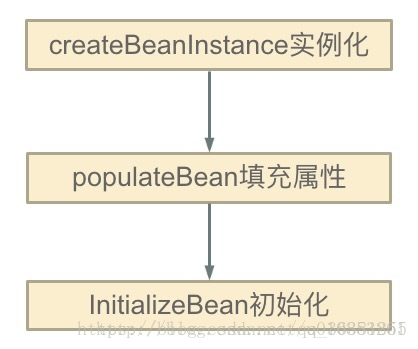

## 1.判断Java对象是否存活

根搜索法 GC roots

如果一个对象有另一个对象的引用，那么就认为第一个对象指向第二个对象的边。
JVM 会从一个线程的所有GC roots 开始向下遍历，当遍历完之后如果返现有一些不可道道，则认为这些对象没有用了。
需要被回收，引用计数法。

CMS GC

* 1.cms只会回收老年代和永久带（1.8开始为元数据区，需要设置CMSClassUnloadingEnabled），不会收集年轻带；
* 2.cms是一种预处理垃圾回收器，它不能等到old内存用尽时回收，需要在内存用尽前，完成回收操作，否则会导致并发回收失败；所以cms垃圾回收器开始执行回收操作，有一个触发阈值，默认是老年代或永久带达到92%；

JVM 内存模型

1.堆主要是对象 线程共享
2.方法区 （运行时常量池，已加载的类信息）[方法区](https://www.breakyizhan.com/javamianshiti/2839.html) 线程共享

tips:首先，方法区是JVM规范的一个概念定义，并不是一个具体的实现，每一个JVM的实现都可以有各自的实现；然后，在Java官方的HotSpot 虚拟机中，Java8版本以后，是用元空间来实现的方法区；在Java8之前的版本，则是用永久代实现的方法区；也就是说，“元空间” 和 “方法区”，一个是HotSpot 的具体实现技术，一个是JVM规范的抽象定义；所以，并不能说“JVM的元空间是方法区”，但是可以说在Java8以后的HotSpot 中“元空间用来实现了方法区”。然后多说一句，这个元空间是使用本地内存（Native Memory）实现的，也就是说它的内存是不在虚拟机内的，所以可以理论上物理机器还有多个内存就可以分配，而不用再受限于JVM本身分

3.栈 

 

JVM 加载类的过程

[双亲委派加载机制](https://www.jianshu.com/p/1a20b85668fd)

加载--链接（验证-准备-解析）--初始化--使用--卸载
[链接](https://blog.csdn.net/zhaocuit/article/details/93038538)

Spring 解决循环依赖[点这](https://blog.csdn.net/qq_36381855/article/details/79752689)

 Spring的循环依赖的理论依据其实是基于Java的引用传递，当我们获取到对象的引用时，对象的field或zh属性是可以延后设置的(但是构造器必须是在获取引用之前)。

①：createBeanInstance：实例化，其实也就是 调用对象的构造方法实例化对象

②：populateBean：填充属性，这一步主要是多bean的依赖属性进行填充

③：initializeBean：调用spring xml中的init() 方法。

从上面讲述的单例bean初始化步骤我们可以知道，循环依赖主要发生在第一、第二步。也就是构造器循环依赖和field循环依赖。

那么我们要解决循环引用也应该从初始化过程着手，对于单例来说，在Spring容器整个生命周期内，有且只有一个对象，所以很容易想到这个对象应该存在Cache中，Spring为了解决单例的循环依赖问题，使用了三级缓存。

  
调整配置文件，将构造函数注入方式改为 属性注入方式 即可
 
 三级缓存

 singletonFactories ： 单例对象工厂的cache 
 earlySingletonObjects ：提前暴光的单例对象的Cache 。【用于检测循环引用，与singletonFactories互斥】
 singletonObjects：单例对象的cache

 上面的代码需要解释两个参数：

isSingletonCurrentlyInCreation()判断当前单例bean是否正在创建中，也就是没有初始化完成(比如A的构造器依赖了B对象所以得先去创建B对象， 或则在A的populateBean过程中依赖了B对象，得先去创建B对象，这时的A就是处于创建中的状态。)
allowEarlyReference 是否允许从singletonFactories中通过getObject拿到对象

